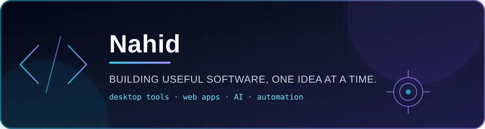

  

  
  

## Hey, I'm Nahid 👋

I'm a computer science student who enjoys turning ideas into practical software—from desktop utilities and interactive web experiences to APIs and automation.

- 🧩 Building clean, practical tools for everyday problems
- 🖥️ Building polished Windows desktop experiences
- 🤖 Experimenting with AI-powered APIs and useful automation
- 🧭 Interested in projects that solve a clear, everyday problem

## Featured work

| Project | What it does | Built with |
| --- | --- | --- |
| [**GetClapped**](https://github.com/nahidmrdl/getclapped) | Learns clap sequences and launches configurable Windows actions. | Python · Tkinter · Audio |
| [**Yahoo Stock Monitor**](https://github.com/nahidmrdl/yahoo-stock-monitor) | Desktop stock dashboard with persistent ticker widgets and Windows releases. | Electron · JavaScript |
| [**Budapest Districts**](https://github.com/nahidmrdl/BudapestDistricts) | Interactive visual guide to the districts of Budapest. | HTML · CSS · JavaScript · SVG |
| [**AI Prompt Directory**](https://github.com/nahidmrdl/ai-prompt-directory) | Stores, searches, renders, and rates reusable AI prompt templates. | Python · FastAPI |

## Toolkit

  

## Let's build something useful

I like projects with a strong idea, a clear interface, and room to learn. If one of my repositories sparks an idea, open an issue or start a conversation.

  

